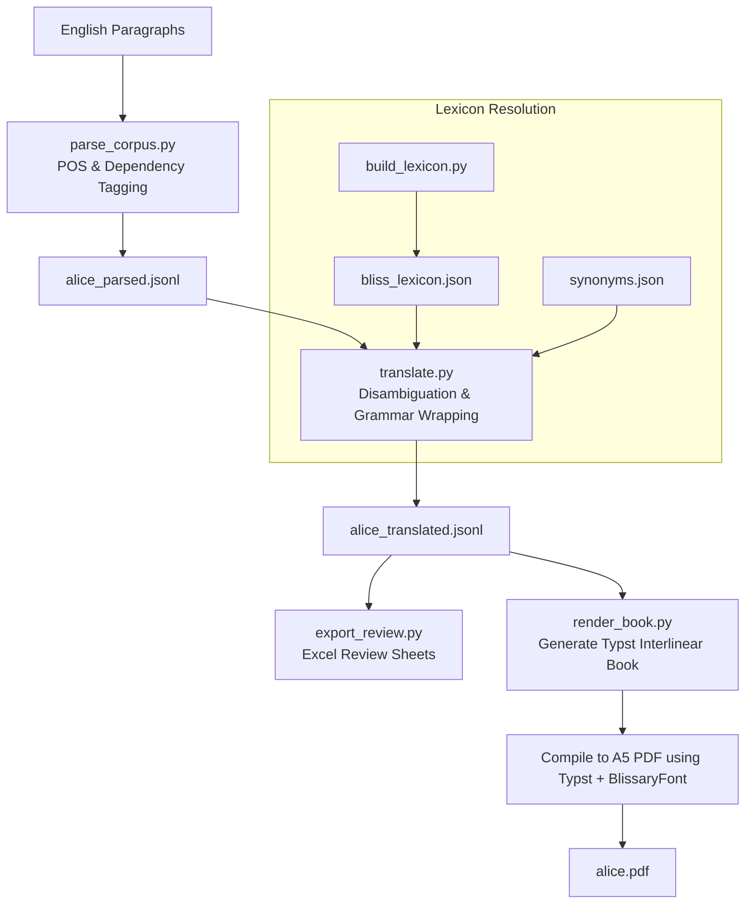

# BlissNLP — Natural Language Translation Engine for Blissymbolics

`BlissNLP` is a computational translation pipeline that translates English text (starting with *Alice's Adventures in Wonderland*) into a grammatically structured, typeset Blissymbolics digital corpus, using the **BCI Authorized Vocabulary (BCI-AV) 2025-02-15** release.

It operates in tandem with the sibling [`BlissFont`](https://github.com/aactools/BlissFont) repository to render compiled symbol books.

---

## 📖 How It Works (For Laypersons)

Translate text into symbols is a lot harder than doing a simple search-and-replace:
1. In English, a word like "went" is the past tense of "go." We have to recognize "go" as the base action and flag the "past" aspect.
2. Words are ambiguous. "The river bank" uses a completely different symbol than "the money bank."

`BlissNLP` works like a translator in the background:
1. **The Grammar Analyzer**: It reads your English sentences and determines the parts of speech (nouns, verbs) and the tenses (past, present).
2. **The Dictionary Resolver**: It figures out the correct meaning of ambiguous words based on context and maps them to BCI concepts.
3. **The Typesetter**: It packs the symbols and the original English words into stacked pairs (like lyrics under music notes) using standard web fonts compiled by `BlissFont`, rendering them automatically as a readable, responsive paragraph.

---

## 📐 Translation & Layout Pipeline

The translation engine processes natural language text through four stages to output typeset documents.



---

## 📂 Directory Structure

```text
BlissNLP/
├── pyproject.toml             # Python dependencies (managed by uv)
├── README.md                  # This documentation
├── TODO.md                    # Work-package task tracker
├── Alice...Specification.md   # System translation specifications
├── data/
│   ├── lexicon/               # Tracked rules (synonyms, disambiguation)
│   │   ├── synonyms.json      # Maps spaCy lemmas -> BCI glosses
│   │   └── disambiguation_rules.json # Word Sense Disambiguation guidelines
│   ├── raw/                   # [Gitignored] Raw source corpora
│   └── processed/             # [Gitignored] Intermediate parsed corpora & dictionaries
├── scripts/
│   ├── setup_models.py        # Installs the spaCy English pipeline
│   ├── download_data.py       # Fetches Alice in Wonderland Gutenberg source
│   ├── parse_corpus.py        # Stage 1: Syntactic parsing & dependency mapping
│   ├── build_lexicon.py       # Stage 2 prep: Translates BCI Excel sheet to JSON Lexicon
│   ├── translate.py           # Stages 2 & 3: WSD + Concept Mapping + Indicator Assembly
│   ├── load_blissfont.py      # Refreshes BCI-ID -> Unicode map from sibling BlissFont
│   ├── apply_reviews.py       # Ingests human reviews back into dictionaries
│   ├── export_review.py       # Stage 4: Generates review spreadsheets
│   └── render_book.py         # Generates Typst code for interlinear typesetting
└── tests/
    └── test_pipeline.py       # Regression test suite (uv run pytest)
```

---

## 🛠️ Step-by-Step Script Pipeline

### 1. Syntactic Parsing (`parse_corpus.py`)
Parses paragraphs using the `en_core_web_sm` model. It extracts word lemmas, tags parts of speech (nouns, verbs, adjectives), identifies verb tenses (past, present, continuous), and flags clause-level negation.

### 2. Lexicon Mapping (`build_lexicon.py` & `translate.py`)
Resolves English lemmas to official BCI concepts. Because verb lemmas like `read` are glossed as `read-(to)` in BCI, it utilizes the synonym database (`data/lexicon/synonyms.json`) to bridge the naming mismatch. Ambiguity is resolved using contextual word rules.

### 3. Visual Assembly (`translate.py`)
Wraps BCI IDs in grammatical indicators based on spaCy's tags:
* If a token is a verb and has `tense: past`, it appends the past indicator `9004`.
* If a token is a noun and has `number: plural`, it appends the plural indicator `27112`.
* Negated clauses are flanked by the `not` marker `15733`.
It then resolves these BCI IDs to stable Plane 15 PUA codepoints (`0xF0000 + bci_id`) or official proposed Unicode scalars.

### 4. Human Review & Typesetting
`export_review.py` exports flagged or low-confidence translations to Excel for human translators. `render_book.py` outputs Typst markup, pairing symbols and text vertically using the `<ruby>` interlinear paradigm.

---

## 🚀 Quickstart (End-to-End Run)

Requires **Python 3.11+** and [**uv**](https://github.com/astral-sh/uv).

```bash
# Clone dependencies and sync environment
uv sync

# Download spaCy models
uv run python scripts/setup_models.py

# Download Gutenberg source
uv run python scripts/download_data.py

# Parse syntax, build lexicon, and translate text
uv run python scripts/parse_corpus.py
uv run python scripts/build_lexicon.py
uv run python scripts/translate.py

# Load unicode mappings from sibling BlissFont directory
uv run python scripts/load_blissfont.py

# Render the interlinear Typst file
uv run python scripts/render_book.py

# Compile the Typst PDF (requires typst installed)
typst compile --font-path book/fonts book/alice.typ book/alice.pdf
```
